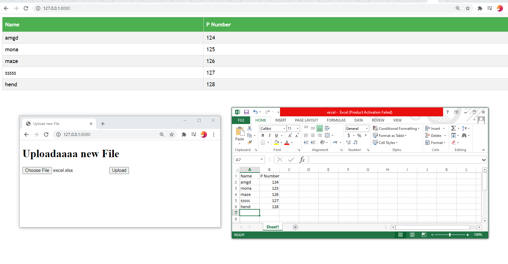

# Excel_to_HTML

in order to setup this app you need to follow this instructions
https://github.com/MahmoudHegazi/Project-Linux-Server-Configuration


google sheet_ new update + make it excel to html or google sheet to html
https://www.youtube.com/watch?v=vISRn5qFrkM

```python
mport pdfkit

pdfkit.from_url('http://google.com', 'out.pdf')
pdfkit.from_file('test.html', 'out.pdf')
pdfkit.from_string('Hello!', 'out.pdf')  # Is your requirement?
```
https://stackoverflow.com/questions/28165704/convert-html-to-pdf-using-python-flask

#### later will be restful working API and use of my API
https://developers.convertio.co/api/docs/

https://help.parsehub.com/hc/en-us/articles/217751808-API-Tutorial-How-to-get-run-data-using-Python-Flask


